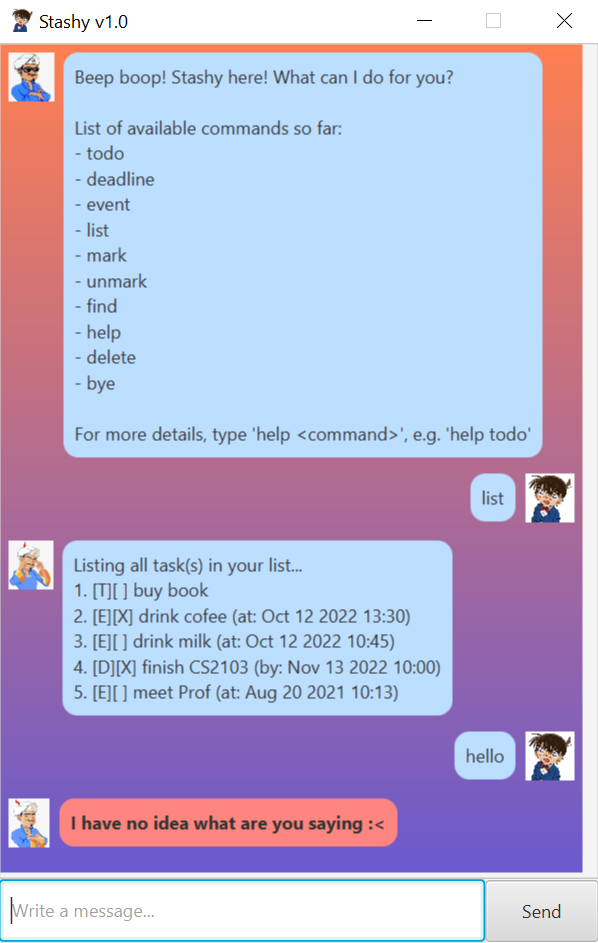

# Stashy - User Guide

```
 ____  ____  __   ____  _  _  _  _ 
/ ___)(_  _)/ _\ / ___)/ )( \( \/ )
\___ \  )( /    \\___ \) __ ( )  / 
(____/ (__)\_/\_/(____/\_)(_/(__/  
```

## Features 

### ToDo, Event, Deadline

Stashy supports different types of task to be managed. This can be those without a due time
or an occuring time, and those with either one of them.

### Mark, Unmark, Delete, List

Stashy manages the tasks in a list and support modifications on the task list such as
marking a task as done, unmarking a task as not done, deleting a task, or listing all tasks
in the task list.

### Find and Help

Stashy supports searching tasks with a given keyword query, as well as providing a help message
for each existing command.

### GUI

Stashy has an interactive GUI where errors are shown as red messages, and Stashy's profile picture
will change randomly to make the chat more engaging.

## Usage

### `todo` - Add a todo

This command adds a todo task into the task list.

Format:

`todo <DESCRIPTION>`

Example of usage: 

`todo Finish Mission 3`

Expected outcome:

A new todo is added into the task list.

```
There, we have a new todo:
  [T][ ] Finish Mission 3
You have 1 task(s) in the list.
```

### `deadline` - Add a deadline

This command adds a deadline task into the task list.

Format:

`deadline <DESCRIPTION> /by <TIME>`

Example of usage: 

`deadline Buy milk /by Aug 10 2022 13:30`

Expected outcome:

A new deadline with the given due time is added into the task list.

```
There, we have a new deadline:
  [D][ ] Buy milk (by: Aug 10 2022 13:30)
You have 1 task(s) in the list.
```

Acceptable formats for `<TIME>`:
- "MMM dd yyyy HH:mm", e.g. `Aug 10 2022 13:30`
- "dd/MM/yyyy HH:mm", e.g. `10/08/2022 13:30`
- "yyyy/MM/dd HH:mm", e.g. `2022/08/10 13:30`
- "yyyy/MM/dd'T'HH:mm", e.g. `2022/08/10T13:30`
- "yyyy-MM-dd HH:mm", e.g. `2022-08-10 13:30`
- "dd MMM yyyy HH:mm", e.g. `10 Aug 2022 13:30`
- "MMM dd, yyyy HH:mm", e.g. `Aug 10, 2022 13:30`

(optionally, you omit the colon between HH and mm)


### `event` - Add an event

This command adds an event task into the task list.

Format:

`event <DESCRIPTION> /at <TIME>`

Example of usage: 

`event Go to Jurong /at Aug 10 2022 13:30`

Expected outcome:

A new event with the given timing is added into the task list.

```
There, we have a new event:
  [E][ ] Go to Jurong (at: Aug 10 2022 13:30)
You have 1 task(s) in the list.
```

Acceptable formats for `<TIME>`:
- "MMM dd yyyy HH:mm", e.g. `Aug 10 2022 13:30`
- "dd/MM/yyyy HH:mm", e.g. `10/08/2022 13:30`
- "yyyy/MM/dd HH:mm", e.g. `2022/08/10 13:30`
- "yyyy/MM/dd'T'HH:mm", e.g. `2022/08/10T13:30`
- "yyyy-MM-dd HH:mm", e.g. `2022-08-10 13:30`
- "dd MMM yyyy HH:mm", e.g. `10 Aug 2022 13:30`
- "MMM dd, yyyy HH:mm", e.g. `Aug 10, 2022 13:30`

(optionally, you omit the colon between HH and mm)

### `mark` - Mark a task as done

This command marks a task in the task list as done.

Format:

`mark <TASK_ID>`

Example of usage: 

`mark 3`

Expected outcome:

The third task in the task list, assuming it exists, is marked as done.

```
LFG, marking this task as done!
  [E][X] example event (at: Oct 12 2022 10:45)
```

### `unmark` - Unmark a task as not done

This command unmarks a task in the task list as not done.

Format:

`unmark <TASK_ID>`

Example of usage: 

`unmark 4`

Expected outcome:

The fourth task in the task list, assuming it exists, is unmarked as not done.

```
L + ratio, unmarking this task as not done!
  [D][ ] finish CS2103 (by: Nov 13 2022 10:00)
```

### `delete` - Delete a task

This command deletes a task from the task list.

Format:

`delete <TASK_ID>`

Example of usage: 

`delete 1`

Expected outcome:

The first task from the task list, assuming it exists, is deleted.

```
Task has been removed!
  [T][ ] example todo
You have 0 task(s) in the list.
```

### `find` - Find all tasks

This command finds all tasks based on a keyword query

Format:

`find <KEYWORD>`

Example of usage: 

`find hello world`

Expected outcome:

All tasks with the word(s) 'hello world' in their description are shown. The keyword
is case-insensitive.

```
Listing all the matching task(s)...
1. [E][X] say HelLo worlD! (at: Oct 12 2022 13:30)
2. [T][ ] hello world
```

### `list` - List all tasks

This command lists all the tasks currently in the task list.

Example of usage: 

`list`

Expected outcome:

The whole task list is shown.

### `help` - The help page

Shows the list of commands or the help page for a given command.

Format:

`help [<COMMAND>]`

Example of usage: 

`help todo`

Expected outcome:

A help page for the `todo` command is shown.

```
todo

Adds a todo task.

Example: todo buy book
```

### `bye` - Exit the application

This command exits the application and automatically saves your current
task list for future use.

Example of usage: 

`bye`

Expected outcome:

A goodbye message is shown.

```
Good bye then, see you some time! - Stashy, 2022

Press Enter to close the application...
```

## Command Summary
|Action|Format|Example|
|:-|:-|:-|
|ToDo|`todo <DESCRIPTION>`|`todo Finish Mission 3`|
|Deadline|`deadline <DESCRIPTION> /by <TIME>`|`deadline Buy milk /by Aug 10 2022 13:30`|
|Event|`event <DESCRIPTION> /at <TIME>`|`event Go to Jurong /at Aug 10 2022 13:30`|
|Mark|`mark <TASK_ID>`|`mark 3`|
|Unmark|`unmark <TASK_ID>`|`unmark 4`|
|Delete|`delete <TASK_ID>`|`delete 1`|
|Find|`find <KEYWORD>`|`find hello world`|
|List|`list`|`list`|
|Help|`help [<COMMAND>]`|`help`, `help todo`|
|Exit|`bye`|`bye`|

## Showcase

